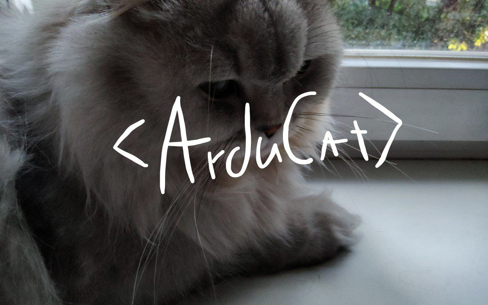

## Дарова!

Меня зовут Савва, я российский программист. Мой псевдоним - ArduCat.  

📚 Знаю: C++, Rust, Python  
📖 Учу: D  

Однако я не только программист, я еще и волшебник, работающий с Arch и Alpine Linux :D  

**Я сижу здесь:**  
Mastodon: https://mastodon.social@arducat  
Matrix: @arducat_matrix:matrix.org  
 
## Статистика:

!! Статистика может быть слегка outdated !!
